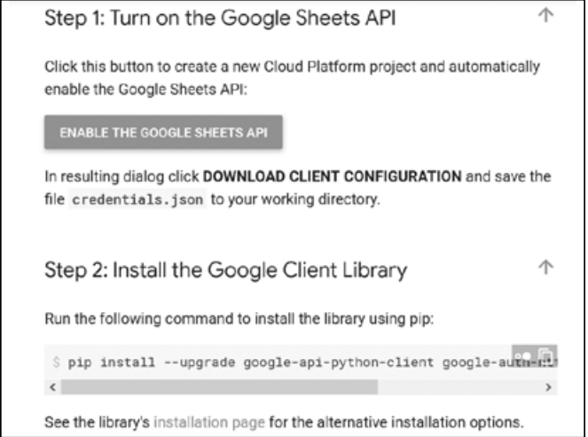
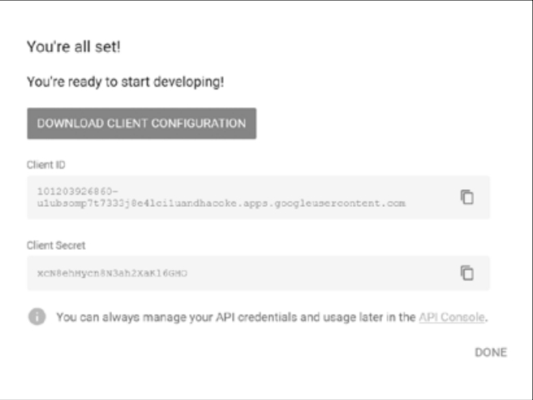
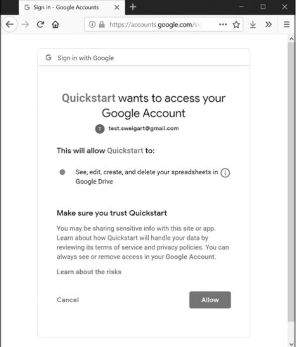
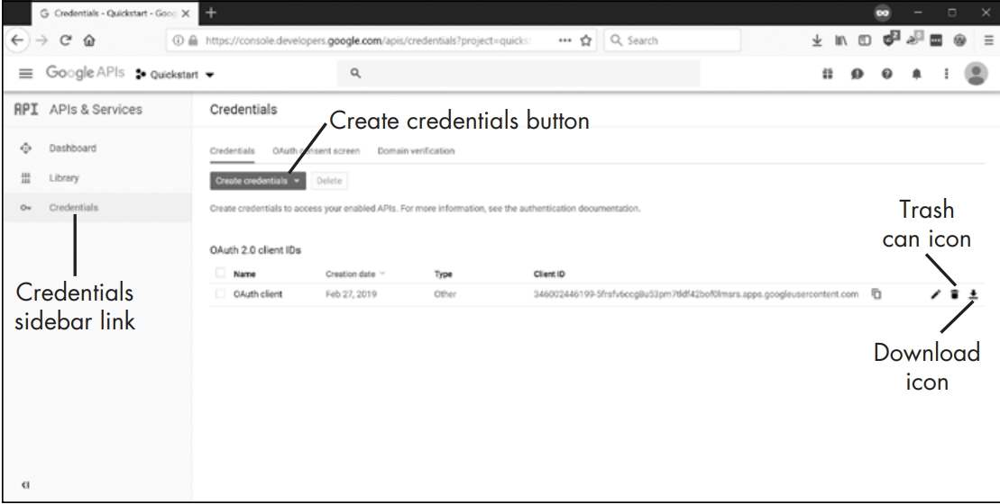

# Setting Up Google Sheets and Drive API for EZSheets

## Overview

To use the EZSheets Python library for interacting with Google Sheets and Google Drive, you'll need to set up API access and obtain specific credentials and token files. This guide will walk you through the steps required to obtain these files and configure your environment.

## Steps to Obtain Credentials and Token Files

### 1. Enable Google Sheets and Google Drive APIs

Before you can use EZSheets, you need to enable the necessary APIs for your Google account. Follow these steps:

1. **Google Sheets API**:
   - Visit the [Google Sheets API Library](https://console.developers.google.com/apis/library/sheets.googleapis.com/).
   - Click the "Enable" button at the top of the page.
   - 

2. **Google Drive API**:
   - Visit the [Google Drive API Library](https://console.developers.google.com/apis/library/drive.googleapis.com/).
   - Click the "Enable" button at the top of the page.

### 2. Obtain Credential Files

You will need to download and configure the following files:

- **Credentials File**: `credentials-sheets.json`
- **Google Sheets Token**: `token-sheets.pickle`
- **Google Drive Token**: `token-drive.pickle`

#### Downloading the Credentials File

1. Go to the [Google Sheets Python Quickstart](https://developers.google.com/sheets/api/quickstart/python) page.
2. Click the blue "Enable the Google Sheets API" button.
   - This will open a new window prompting you to log in to your Google account if you haven't already.
3. Once logged in, you'll be presented with a "Download Client Configuration" link.
   - Click the link to download the `credentials.json` file.
   - Rename this file to `credentials-sheets.json` and place it in the same directory as your Python script.
   - 

### 3. Generate Token Files

1. **Initial Setup**:
   - Run the import for the EZSheets module in your Python environment:
     ```python
     import ezsheets
     ```
   - The first time you import EZSheets, a browser window will open for you to log in to your Google account and grant permissions.
   - Click "Allow" to enable EZSheets to access Google Sheets and Drive.
   - 

2. **Token Files**:
   - After granting access, two files will be created in the same directory as `credentials-sheets.json`:
     - `token-sheets.pickle`
     - `token-drive.pickle`
   - These tokens are used for accessing Google Sheets and Google Drive.

### 4. Revoking the Credentials File

If you accidentally share the credential or token files with someone, they will have access to your spreadsheets. To revoke these files:

1. Go to the [Google Cloud Platform developer’s console](https://console.developers.google.com/) and log in to your Google account.
2. Click the **Credentials** link on the sidebar.
3. Find the credentials file you want to revoke and click the trash can icon next to it.
   - 

#### Generating a New Credentials File

To generate a new credentials file:

1. Click the **Create Credentials** button on the same page and select **OAuth client ID**.
2. For **Application Type**, select **Other** and give the file any name you like.
3. Download the new credentials file and rename it to `credentials-sheets.json`.


Alternatively, you can generate a new credential file by clicking the **Enable the Google Sheets API** button on the [Google Sheets Python Quickstart](https://developers.google.com/sheets/api/quickstart/python) page.

### 5. Troubleshooting

- **Error Handling**: If the browser window hangs after clicking "Allow," ensure you have enabled both the Google Sheets and Google Drive APIs as described above. It may take a few minutes for Google’s servers to register these changes, so waiting a bit before trying again might resolve the issue.

### 6. Security

- **File Security**: Treat the credential and token files like passwords. Do not share these files with anyone or expose them publicly.

## Summary

By following these steps, you will configure your environment to use EZSheets for interacting with Google Sheets and Google Drive. Ensure that the credentials and token files are securely stored and not shared with unauthorized parties.

For further information, refer to the [EZSheets Documentation](https://ezsheets.readthedocs.io/en/latest/).
